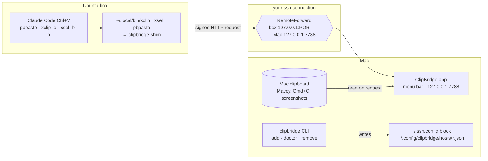
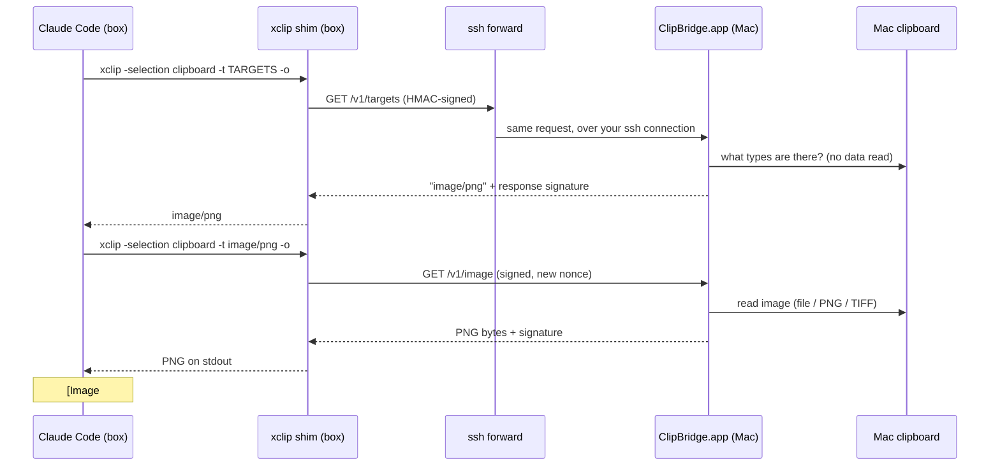

# How clipbridge works

clipbridge lets programs on a remote Linux box read your **Mac's** clipboard over SSH. Copy a screenshot
on the Mac, press Ctrl+V in Claude Code running on the box, and the image is attached. `pbpaste`,
`xclip -o` and `xsel -b -o` on the box return what you copied too.

Nothing is pushed or synced. The box **asks** for the clipboard, only at the moment a program reads it,
through the SSH connection you already have open.

---

## The pieces



| Piece | Where | What it does |
|---|---|---|
| **ClipBridge.app** | Mac menu bar, started at login | Listens only on `127.0.0.1:7788`. Answers signed requests with the current clipboard image or text. Shows status, hosts and recent pulls. |
| **`clipbridge` CLI** | Mac, `~/.local/bin/clipbridge` | Sets hosts up and tears them down, and checks them (`doctor`). The app's menu actions call it too. |
| **ssh config block** | Mac, `~/.ssh/config` | Adds a reverse forward to each connection, so the box can reach the Mac app. |
| **clipbridge-shim** | Box, `~/.local/bin` | Stands in for `xclip`, `xsel` and `pbpaste`. Clipboard reads go to the Mac; everything else goes to the real tool. |

---

## What happens when you press Ctrl+V



1. Claude Code on Linux reads the clipboard by running `xclip`. Because `~/.local/bin` comes first on
   PATH, it runs the shim instead of `/usr/bin/xclip`.
2. The shim takes the host name, forward port and **session key** from `LC_CLIPBRIDGE` in its
   environment. Your ssh client put it there when you connected; inside tmux, it comes from the tmux
   session that `clipbridge-attach` filled in. It then sends a request signed with the key to
   `127.0.0.1:<port>` on the box. **No key, no request:** a shell without it just runs the real
   `xclip`/`pbpaste`.
3. That port is the **RemoteForward** your ssh connection opened. The request travels back over SSH to
   `127.0.0.1:7788` on the Mac.
4. ClipBridge.app checks the signature, the timestamp and that the nonce hasn't been used before. It then
   reads the pasteboard and replies, signing the reply with the same token.
5. The shim checks the reply's signature, prints the bytes, and Claude Code attaches the image.

If there's no image, Claude Code falls back to `xclip -t text/plain -o` and pastes the text. That goes
through the same path.

---

## Setting up a host

From the menu: **Add host…** → pick the alias from your `~/.ssh/config` → Add. From a terminal:
`clipbridge add <alias>`.

`add` makes these changes:

**On the Mac**
- adds one block to `~/.ssh/config` (a backup is written next to it first):
  ```
  # clipbridge begin
  Match all
  Include ~/.config/clipbridge/ssh_config
  # clipbridge end
  ```
  and writes the included file, `~/.config/clipbridge/ssh_config` (0600, generated; holds the keys):
  ```
  Host devbox 100.64.0.12 192.168.1.40
    RemoteForward 127.0.0.1:23187 127.0.0.1:7788
    ControlMaster auto
    ControlPath ~/.ssh/cm/%C
    ControlPersist 10m
    ServerAliveInterval 15
    ServerAliveCountMax 3
    SetEnv LC_CLIPBRIDGE=v1:devbox:23187:<session key>
  ```
  `SetEnv` is how each of your sessions gets the key: sshd puts it in that session's environment. Most
  Linux sshd configs accept `LC_*` variables from clients (`AcceptEnv LANG LC_*`); `doctor` checks.
  The remote port (here 23187) is picked at random per host. **ControlMaster** makes every session to the
  box share one connection and so one forward. Without it, the second session would fail to bind the
  same port.
- writes `~/.config/clipbridge/hosts/<alias>.json` (0600), holding:
  - the token and port
  - the names the block matches, and when each was added
  - the box's own IPv4 addresses, used to spot a session that reached the box by an address the block
    doesn't match

**On the box**
- `~/.local/bin/clipbridge-shim`, with `xclip`, `xsel` and `pbpaste` symlinked to it
- `~/.local/bin/clipbridge-attach`, the tmux helper (below)
- **no key**: nothing secret is written on the box (older versions kept one in
  `~/.config/clipbridge/config.json`; `add` deletes it)
- a marked block at the end of `~/.zshrc` (or `~/.bashrc`) that puts `~/.local/bin` first on PATH

**Then open a new ssh session.** A session that was already open has no forward.

---

## Which connections get the clipboard (the IP problem)

ssh applies a `Host` block only when the **name you typed** matches it. If the block says
`Host devbox`:

| You run | Matches the block? | Clipboard? |
|---|---|---|
| `ssh devbox` | yes | ✅ |
| `ssh -p 61122 devbox@100.64.0.12` | only if `100.64.0.12` is listed | ✅ / ❌ |
| `ssh -p 61122 devbox@192.168.1.40` | only if `192.168.1.40` is listed | ✅ / ❌ |

A box usually has several addresses (LAN, Tailscale, …), so clipbridge matches more than the alias:
- **the alias and its `HostName`:** added automatically
- **other addresses you use:** add them with **Also match another IP or name…** in the host's submenu,
  or `clipbridge add <alias> --also <ip>`
- **the box's own addresses:** after setup, the app lists them and offers **Match all**

The app also watches your running `ssh` processes, every 20 seconds and whenever you open the menu. It
warns about two cases:
- **"… via 192.168.1.40 can't see the clipboard. Fix…"**
  - Cause: you're connected to a set-up box by one of its addresses that isn't matched.
  - Fix: click it to add that address, then reconnect the session.
  - The menu-bar icon turns into a ⚠︎ while this is the case.
- **"… opened before setup. Reconnect it"**
  - Cause: the session started before clipbridge matched that name, so it has no forward.
  - Fix: exit it and ssh in again.

Sessions without a terminal (`ssh -T`, `-N`, `-W`, `-f`: tunnels and proxies) are ignored; nothing in
them pastes.

---

## Shared accounts and tmux

Several people often log in to the same account on a box (a shared `deploy` or `ubuntu` user, say). clipbridge is
**session-based** so they don't get your clipboard:

| Shell | Has the key? | `pbpaste` / Ctrl+V gets |
|---|---|---|
| started by *your* ssh session | yes (`LC_CLIPBRIDGE` from your Mac) | your Mac clipboard |
| someone else's session on the same account | no | the real tool (nothing, on a server); your forward is never contacted |
| inside tmux, while you're attached with `clipbridge-attach` | yes (read from the tmux session) | your Mac clipboard |
| inside tmux, after you detach | no (cleared on detach) | the real tool |
| a session you opened before the key last changed | an old key, refused | nothing, until you reconnect (the menu warns) |

**tmux:** use `clipbridge-attach` instead of `tmux attach`; it takes the same arguments. It hands your
session's key to that tmux session through tmux's `update-environment`, never on a command line. Panes
that already exist pick it up too, because the shim asks tmux directly. When you detach it clears the
key, so whoever attaches next gets nothing. While you're attached, anyone else attached to the *same*
tmux session can paste too: they're sharing your screen anyway.

**Key rotation:** keys change every time ClipBridge starts, and with **Rotate key now** in the host's
submenu or `clipbridge rotate <alias>`. Only the Mac changes; new sessions pick up the new key.

## Security

| Concern | How it's handled |
|---|---|
| Other machines on your network | The app listens on `127.0.0.1` only. |
| Other accounts on the box | Every request needs an HMAC-SHA256 made with the host's 32-byte session key. Only your ssh sessions hold it, in their environment; it's never on the box's disk, never on a command line (so not in `ps`), and never sent over the wire. |
| Other people on the *same* account | Their shells don't have the key, so their `pbpaste`/Ctrl+V never contact your forward. The key changes every time ClipBridge starts. |
| Replayed or forged requests | Each request has a timestamp (±60 s) and a single-use nonce, both covered by the MAC. |
| Someone grabbing the forward port first to feed you fake data | Every response is signed too. The shim discards anything that doesn't verify. |
| Old clipboard contents leaking later | Only content copied in the last **2 minutes** is served (menu: 2 min / 10 min / Off). Whatever is on the clipboard when the app starts counts as stale until you copy something. |
| Passwords | Items that password managers mark as concealed or transient (`org.nspasteboard.ConcealedType` etc.) are **never** served. |
| Seeing who pulled what | Every pull is logged to `~/Library/Logs/clipbridge.log` (host, route, status, size; never the content) and listed under *Recent pulls*. |
| **What it can't stop** | Processes inside *your* sessions can read the clipboard while the 2-minute window is open, including Claude Code's own Bash tool. Someone on the same account who *deliberately* reads your live shell's environment (`/proc/<pid>/environ`) or your attached tmux session, or anyone with root, can get the key until it next changes. Use **Pause** before copying something sensitive that isn't marked as concealed. |

---

## The menu

```
ClipBridge: On
Pause
──────────
⚠︎ 1 ssh session to devbox via 192.168.1.40 can't see the clipboard. Fix…
──────────
Hosts
  devbox  ▸  Matches: devbox, 100.64.0.12, 192.168.1.40
                    Not matched: 10.0.0.12, 100.64.0.13
                    Also match another IP or name…
                    Rotate key now
                    Run doctor
                    Remove…
Add host…
──────────
Serve copies from the last…  ▸  2 minutes · 10 minutes · Off
Notify on pull
──────────
Recent pulls
  devbox · image · 14:31:52 · 157 bytes
──────────
Copy doctor command · Open log · Quit ClipBridge
```

---

## Troubleshooting

Run **Run doctor** from the host's submenu, or `clipbridge doctor <alias>`. It checks:
- the app and its listener
- the ssh config
- clock skew
- the forward on the box
- that `xclip`, `xsel` and `pbpaste` resolve to the shims in a login shell
- a round trip, comparing the hash of the current clipboard on the Mac and on the box

| Symptom | Likely cause | Fix |
|---|---|---|
| Ctrl+V does nothing, or says "No image found… try scp?" | The session was opened before setup, or by an unmatched IP | Check the menu for a ⚠︎ line; reconnect, or **Fix…** |
| Works for a while, then stops | You copied the image more than 2 minutes ago | Copy again, or widen the window in the menu |
| Cmd+V pastes nothing | In iTerm2, Cmd+V is the terminal's text paste; it never asks the clipboard for an image | Use **Ctrl+V** for images |
| `pbpaste` prints nothing for a copied password | Concealed items are never served | Expected |
| doctor: "nothing listening on remote 127.0.0.1:PORT" | No live connection carries the forward | Open a new ssh session; if an old one lingers: `ssh -O exit <alias>` |
| doctor: `xclip` resolves to `/usr/bin/xclip` | `~/.local/bin` isn't first on PATH in that shell | Log in again; check the clipbridge block at the end of `~/.zshrc` |
| doctor: clock skew > 30 s | The box's clock is off, so requests get 401 | Fix NTP on the box |
| Works in a plain session but not inside tmux | The tmux session doesn't have your key | Attach with `clipbridge-attach -t <session>` |
| Stopped working after restarting ClipBridge or rotating | The session still has the old key | Reconnect; the menu lists sessions "opened before the key changed" |
| doctor: "a new session doesn't get the current key" | The box's sshd doesn't accept `LC_*` from clients | Ask the admin for `AcceptEnv LC_*` in sshd_config |
| Works with `ssh <alias>` but not `ssh user@<ip>` | The IP isn't matched | **Also match another IP or name…**, or `clipbridge add <alias> --also <ip>` |
| Paste stops working after a Claude Code update | A newer build may read the clipboard another way | Run `scripts/spike/run.sh <alias> --real`. It starts Claude Code in tmux, presses Ctrl+V and reports. |

## Undo

**Remove one host:** **Remove…** in the host's submenu, or `clipbridge remove <alias>`. On the box this
deletes:
- the shims and `clipbridge-attach`
- the PATH block in `~/.zshrc`/`~/.bashrc`, restored byte for byte
- the tmux settings `clipbridge-attach` made
- any test leftovers (`~/.cache/cb-spike` and its trust entry in `~/.claude.json`)

On the Mac it deletes the host's key and its Host block. It reports anything it couldn't remove.

**Remove everything:** `clipbridge uninstall` (asks first; `-y` to skip the question). It removes every
host as above, then on the Mac:
- the app, its login item and its LaunchServices registration
- its privacy permissions and preferences
- the log
- the `~/.local/bin/clipbridge` link
- `~/.config/clipbridge`
- the block in `~/.ssh/config`, which leaves the file exactly as it was before clipbridge
- the `~/.ssh/config.bak-clipbridge-*` backups (keep them with `--keep-backups`)
- `~/.ssh/cm`, once no ssh connection is using it

At the end it checks that nothing is left and says if something is. Only two things are left to you: the
release folder you installed from (it tells you where), and any ssh connection still open, which closes
within 10 minutes of your last session.
