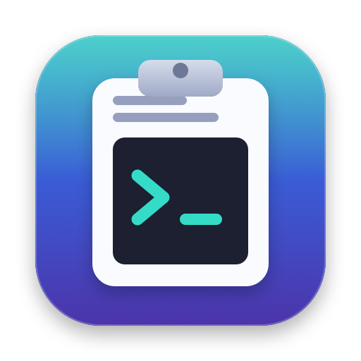
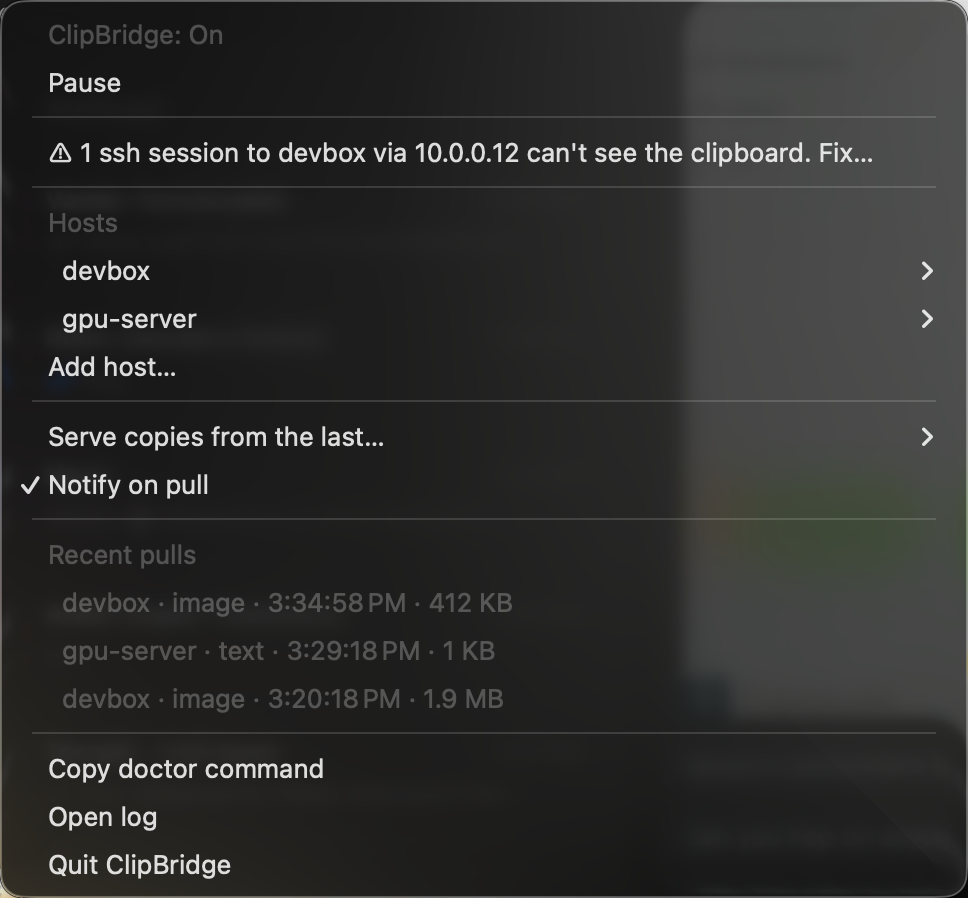
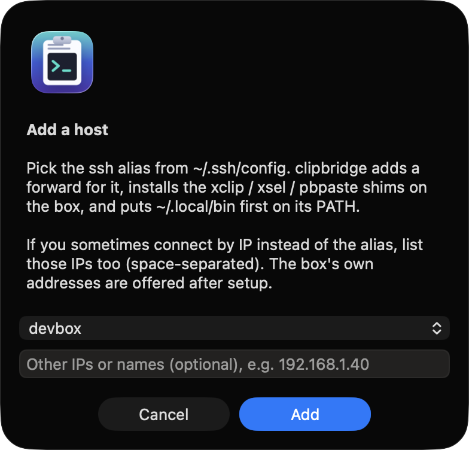
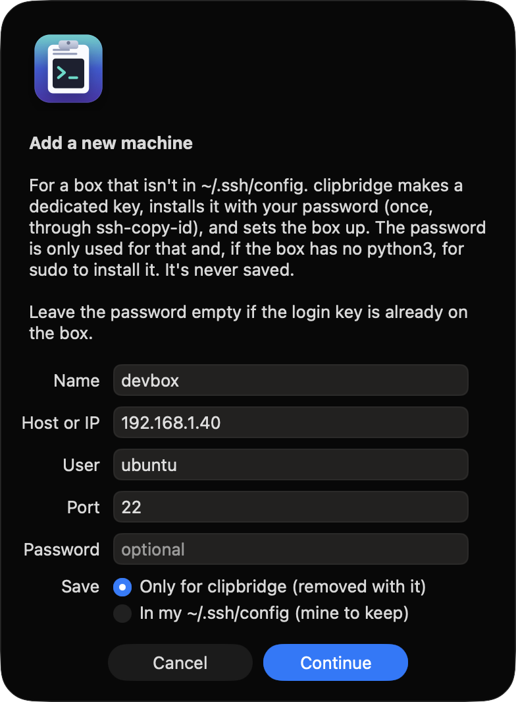
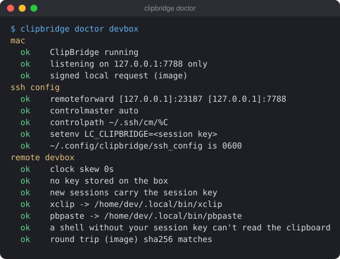

# clipbridge

[](https://github.com/Clumsynite/clipbridge/actions/workflows/ci.yml)
[](https://github.com/Clumsynite/clipbridge/actions/workflows/release.yml)
[](../../releases/latest)


Read your Mac clipboard from SSH sessions. Copy an image or text on the Mac, and on the remote box
`xclip -o`, `xsel -b -o` and `pbpaste` return it. That includes Claude Code: Ctrl+V in a remote Claude
Code session attaches the image you just copied (or pastes the text).

<p align="center">
  
  &nbsp;
  
</p>

> **How it works**, with diagrams, the shared-account model, the IP-matching gotcha and troubleshooting:
> [HOW-IT-WORKS.md](HOW-IT-WORKS.md)

It's one-way, Mac → remote. Nothing is pushed: the remote pulls on demand through your existing SSH
connection, and only when a program asks for the clipboard.

```
Mac: ClipBridge.app (menu bar)                         remote (Ubuntu)
  127.0.0.1:7788  <── ssh RemoteForward 127.0.0.1:<port> ──  ~/.local/bin/{xclip,xsel,pbpaste}
                                                             → clipbridge-shim (python3)
```

## Install

**From a release** (no Xcode needed):

1. Download `ClipBridge-<version>.zip` from the [latest release](../../releases/latest), or with the
   GitHub CLI: `gh release download -R Clumsynite/clipbridge -p 'ClipBridge-*.zip'`.
2. Unzip it somewhere permanent. The CLI keeps running from there, e.g.:
   ```sh
   mkdir -p ~/.local/share/clipbridge && ditto -x -k ClipBridge-*.zip ~/.local/share/clipbridge
   ~/.local/share/clipbridge/ClipBridge-*/bin/clipbridge install
   ```
   `install` copies the app to `~/Applications`, clears the download quarantine (the app is ad-hoc
   signed), starts it at login and links `clipbridge` into `~/.local/bin`.
3. In the menu bar: **Add host…** → pick your ssh alias. Or from a terminal:
   `clipbridge add <ssh-alias>`, then `clipbridge doctor <ssh-alias>`.

**From source** (needs Xcode / Swift 6):

```sh
bin/clipbridge install          # builds ~/Applications/ClipBridge.app, starts it at login, links the CLI
clipbridge add <ssh-alias> [--also <ip>]...   # sets up one host; --also adds other IPs/names you ssh to for it
clipbridge doctor <ssh-alias>   # checks everything end to end (copy an image or text first)
```

`add` does, for that one host:
- adds one marked block to `~/.ssh/config` (a backup is written next to it first) that includes
  `~/.config/clipbridge/ssh_config` (0600). That file has a Host block per host:
  - a RemoteForward on a random per-host port
  - `ControlMaster auto`, `ControlPath ~/.ssh/cm/%C`, `ControlPersist 10m` and keep-alives, so all
    sessions to the host share one connection and one forward
  - `SetEnv LC_CLIPBRIDGE=…`, the host's **session key**
- copies `clipbridge-shim` to the remote `~/.local/bin`, with `xclip`, `xsel` and `pbpaste` symlinked to
  it, plus `clipbridge-attach` for tmux. **Nothing secret is stored on the remote.**
- adds a marked block to the remote `~/.zshrc` (or `~/.bashrc`) that puts `~/.local/bin` first on PATH

It refuses to run if your ssh config already sets ControlMaster/ControlPath/ControlPersist/RemoteForward,
or if the remote `~/.local/bin` already has an `xclip`, `xsel` or `pbpaste` that isn't ours.

The block matches the alias, its `HostName`, and any `--also` names. If you sometimes connect by a
different IP (LAN vs Tailscale, say), add it with `--also` or that connection won't get the forward.
The names are remembered, so running `add` again keeps them.

Open a **new** ssh session after `add`. A connection opened before it has no forward.

Or from the menu bar: **Add host…** picks an alias from `~/.ssh/config` and offers to match the box's
other IPs. Each host's submenu has **Also match another IP or name…**, **Run doctor** and **Remove…**.
The menu also warns, and offers a fix, when one of your running ssh sessions reached a set-up box by an
unmatched address or was opened before setup.

**A machine that isn't in `~/.ssh/config`:** **Add host… → New machine…**, or:

```sh
clipbridge new devbox --host 192.168.1.40 --user ubuntu [--port 22] --password-stdin [--install-python] \
  [--save-to clipbridge|ssh-config]
```

It works like this:
1. It shows the box's host key fingerprint for you to confirm.
2. It makes a dedicated key (`~/.ssh/clipbridge_ed25519`) and installs it with your password, used once
   via `ssh-copy-id` and never saved.
3. If the box has no python3, it offers to install it with sudo.
4. It sets the box up as `devbox`. **You choose where the connection is saved:**
   - **Only for clipbridge** (the default): it lives in clipbridge's own ssh config with the shared
     clipbridge key. `remove`/`uninstall` take everything away again, including the key line in the
     box's `authorized_keys`.
   - **In my `~/.ssh/config`**: a normal Host entry with its own key, `~/.ssh/id_ed25519_<name>`, and
     your `known_hosts`. It's yours: `remove`/`uninstall` take back only clipbridge's parts, and
     `ssh devbox` keeps working.

<p align="center"></p>

**What a box needs:** Linux with `python3` (stdlib only), `bash` or `zsh`, and sshd accepting `LC_*`
from clients. Ubuntu/Debian server and cloud images have all three. No `xclip`, X11 or clipboard tools
are needed: the shims *are* the clipboard. `tmux` is optional.

**tmux:** a shell inside tmux doesn't inherit your ssh session's key. Attach with `clipbridge-attach`
(same arguments as `tmux attach`, e.g. `clipbridge-attach -t claude`). The key is then available to
every pane of that session while you're attached, and cleared when you detach.

Other commands:

```sh
clipbridge rotate <alias>|--all # new session keys (also happens every time ClipBridge starts)
clipbridge pause | resume       # stop / start serving (same as the menu item)
clipbridge status
clipbridge remove <ssh-alias>   # undoes add, locally and on the remote
clipbridge uninstall            # removes everything install and add did, on the Mac and every box (asks first; -y to skip)
```

## What works

| On the remote | Gets |
|---|---|
| Claude Code Ctrl+V | the image (or the text if there's no image) |
| `xclip -selection clipboard -o` (`-t text/plain`, `UTF8_STRING`, …) | text |
| `xclip -selection clipboard -t image/png -o` (any `image/*`) | the image as PNG |
| `xclip -selection clipboard -t TARGETS -o` | the available types |
| `xsel -b -o`, `xsel --clipboard --output` | text |
| `pbpaste` | text |

Everything else runs the real tool if one is installed, or exits 1 if not:
- writes (`xclip -i`, `xsel -i`)
- the primary selection (`xclip -o` with no `-selection`, `xsel -p`)
- other flags

**Neovim** only uses xclip when `$DISPLAY` is set, so tell it about pbpaste directly:

```vim
let g:clipboard = {'name': 'clipbridge', 'paste': {'+': 'pbpaste', '*': 'pbpaste'}, 'copy': {'+': 'true', '*': 'true'}}
```

**Doesn't work:**
- remote → Mac copy (`pbcopy`, `xclip -i`); use OSC 52 in your terminal for that
- apps that talk to an X server directly (vim built with `+clipboard`)

## Images

- **Where the image comes from:** in order, an image file copied in Finder, then `public.png`, then
  `public.tiff`. Copying a non-image file in Finder serves nothing, so its icon is never sent.
- **Size:** PNGs with a long edge of 2000 px or less pass through unchanged. Larger or non-PNG images
  are scaled to a 2000 px long edge and sent as PNG. Claude scales down large images anyway.

## Security model

- **Mac listener:** the app listens only on `127.0.0.1:7788`. Nothing on your network can reach it.
- **Session-based key:** each host has its own random 32-byte key.
  - **Where it lives:** on the Mac only, in 0600 files. Your ssh client hands it to each of *your*
    sessions as the environment variable `LC_CLIPBRIDGE`. It's never written to the remote disk and
    never appears in a command line.
  - **Shared accounts:** if other people log in to the same account on the box, their shells don't have
    the key. Their `pbpaste` / Ctrl+V go to the real tools and never even contact your forward.
  - **Rotation:** the key changes every time ClipBridge starts, and on `clipbridge rotate` or the menu's
    **Rotate key now**. Sessions opened before a rotation must reconnect, and the menu says which.
  - **Requests:** they carry an HMAC-SHA256 over the path, host, timestamp and a random nonce. The key
    itself never travels.
- **Request checks:** stale timestamps (more than 60 s off), replayed nonces and bad MACs get 401.
- **Signed responses:** the shim rejects any response not signed with the token. If another user on the
  box grabs the forward port first, they can't feed you a fake image or text, and they never see your
  token.
- **Freshness window:** only content copied in the last 2 minutes is served (menu: 2 min / 10 min / Off).
  Content already on the clipboard when the app starts counts as stale until you copy something.
- **Password managers:** items they mark as concealed or transient (`org.nspasteboard.ConcealedType`,
  `TransientType`, 1Password) are **never** served. Maccy honours the same markers.
- **What it can't stop:**
  - **Your own sessions:** any process running *inside* one of them (including the remote Claude Code's
    own Bash tool) can read the clipboard while the window is open.
  - **Someone on the same account doing it deliberately:** they could read the key out of your live
    shell's environment (`/proc/<pid>/environ`), or out of a tmux session while you're attached to it.
  - **Root:** anyone with root (or sudo) on the box can do the same.

  The key changes every time ClipBridge starts. Use Pause before copying something sensitive that isn't
  marked as concealed, or remove the host.
- **Log:** every pull is logged to `~/Library/Logs/clipbridge.log` (host, route, status, size; never the
  content) and shown under *Recent pulls* in the menu.

## Notes

- **Signing:** the app is signed with your Apple Development identity if you have one, otherwise
  ad-hoc. macOS may still refuse notifications for a locally built app ("Notifications are not allowed
  for this application"). Pulls are then only logged and listed in the menu.
- **macOS paste privacy:** if macOS asks whether ClipBridge may read the pasteboard, allow it under
  System Settings → Privacy & Security → Paste from Other Apps. The log records the current setting at
  start (`accessBehavior=2` means always allowed).
- **Claude Code versions:** the tested Claude Code builds on Linux (2.1.205 and 2.1.286) read images via
  `xclip`. If a later build reads the clipboard some other way, `scripts/spike/run.sh <alias> --real`
  shows it. That test starts Claude Code in tmux on the remote, presses Ctrl+V and looks for
  `[Image #1]`.

<p align="center"></p>

## Development

```sh
swift test                                            # core: auth, nonces, freshness, images, HTTP, sessions
python3 -m unittest discover -s remote -p 'test_*.py' # shim against a fake server
scripts/bundle.sh [--no-install]                      # build the app (and install it to ~/Applications)
scripts/package.sh                                    # release kit: dist/ClipBridge-<version>.zip + SHA256SUMS
scripts/dev-request.py --host <alias> image|text|targets   # signed request to the local app
scripts/spike/run.sh <alias> [--real]                 # live Claude Code paste test on a host
```

**Lint** (what CI runs):

```sh
shellcheck -s sh remote/clipbridge-attach && shellcheck -s bash scripts/*.sh scripts/spike/*.sh
uvx ruff check .            # or: pipx run ruff check .
zsh -n bin/clipbridge
actionlint
```

**Screenshots:** the app has a demo mode with made-up hosts, so no real infrastructure ends up in
`docs/`:

```sh
BIN=$(swift build --show-bin-path)/ClipBridge
$BIN --demo --open-menu          # pops the menu up with sample hosts, a warning and recent pulls
$BIN --demo --add-host-dialog    # the Add host dialog
python3 scripts/make-doctor-svg.py   # docs/doctor.svg
```

## CI and releases

- **CI** (`.github/workflows/ci.yml`) runs on every push and pull request:
  - **lint:** shellcheck, ruff, actionlint
  - **shim:** the shim tests on Linux, Python 3.10 and 3.12
  - **app:** on macOS, `swift build`, `swift test` and the packaged kit, uploaded as a build artifact
- **Releases** come from CI/CD, never from hand-made tags:
  ```sh
  scripts/bump-version.sh patch    # or minor / major / 1.2.3: updates VERSION + the badge, commits
  git push                         # CI runs; when it passes, Release publishes v<version>
  ```
  The Release workflow (`.github/workflows/release.yml`) runs after a successful CI run on `main`. If
  `v<VERSION>` doesn't exist yet, it tests, builds `ClipBridge-<version>.zip` with `SHA256SUMS.txt`
  at that commit, and publishes the release with generated notes. Otherwise it does nothing.
